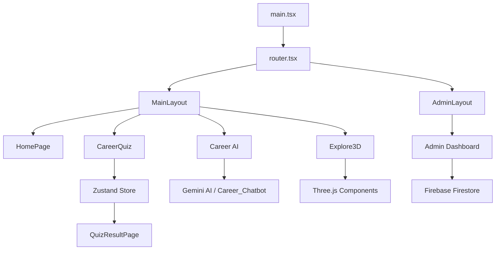

# FuturePath 3D: Project Overview & Architecture Guide

Welcome to the **FuturePath 3D** documentation. This document explains the codebase, the technologies used, and how the various components and features are connected to help you understand the project thoroughly.

---

## 1. Project Introduction
**FuturePath 3D** is a comprehensive Career Guidance Platform designed for students and parents. It leverages AI, 3D visualization (Three.js), and interactive tools to provide personalized career roadmaps, job predictions, and educational stream exploration.

---

## 2. Technology Stack
The project is built with a modern web development stack:
- **Frontend Framework**: [React](https://react.dev/) (v19) with [TypeScript](https://www.typescriptlang.org/)
- **Build Tool**: [Vite](https://vitejs.dev/)
- **Styling**: [Tailwind CSS](https://tailwindcss.com/) for layout and [Framer Motion](https://www.framer.com/motion/) for animations.
- **3D Engine**: [Three.js](https://threejs.org/) via [`@react-three/fiber`](https://docs.pmnd.rs/react-three-fiber/getting-started/introduction) and [`@react-three/drei`](https://github.com/pmndrs/drei).
- **State Management**: [Zustand](https://zustand-demo.pmnd.rs/) for global application state.
- **Backend/Services**: 
  - [Firebase](https://firebase.google.com/) (Authentication and Firestore database).
  - [Google Generative AI (Gemini)](https://ai.google.dev/) for career guidance and chatbot features.
- **Project Structure**: A monorepo-style setup containing the main React frontend and several specialized Python modules.

---

## 3. Project Directory Structure

### Root Directory
| Folder/File | Description |
| :--- | :--- |
| `src/` | **Primary React Source Code**: Contains all the logic for the main web application. |
| `Career_Chatbot/` | **Standalone AI Module**: A Flask/Python-based backend specialized for RAG-powered career inquiries. |
| `Career-Prediction/` | **Deep Learning Module**: Specialized in predicting careers using machine learning models and dataset analysis. |
| `Roadmap/` | **AI Roadmap Generator**: A LangGraph-powered module for generating detailed career progression paths. |
| `public/` | Static assets like 3D models (GLB files), icons, and images. |
| `package.json` | Project dependencies and build scripts. |
| `index.html` | The entry point for the browser. |

### `src/` Folder Structure
- `3d/`: Three.js components and logic for the interactive 3D visualizations (e.g., the Explore3D page).
- `admin/`: Features and layouts for the administrative dashboard (managing streams, departments, jobs).
- `app/`: Global application setup, including the **router configuration** (`router.tsx`).
- `components/`: A library of reusable UI components (buttons, cards, forms, loaders).
- `features/`: High-level feature logic like career prediction integration.
- `layouts/`: Master layouts for the public-facing pages (`MainLayout`) and admin pages (`AdminLayout`).
- `lib/`: Configuration for external services (Firebase client, Three.js instance, etc.).
- `pages/`: Individual page components (Home, Streams, About, Contact, etc.).
- `services/`: API and business logic handlers (handling Firebase, Gemini, and local calculations).
- `store/`: Zustand state definitions for managing user data, favorites, and quiz results globally.
- `types/`: Typescript interfaces and types for consistent data structures across the app.

---

## 4. How the Components Are Connected

### 1. **Routing and Navigation**
The application uses **React Router DOM** (via `src/app/router.tsx`) to manage navigation.
- **MainLayout**: Wraps most pages with a consistent Header and Footer.
- **AdminLayout**: Provides a specialized sidebar and navigation for administrators.

### 2. **State Management (Zustand)**
Found in `src/store/`, it acts as the "brain" of the frontend:
- When a user takes a **Career Quiz** (`src/pages/QuizPage`), the results are calculated and stored in the store.
- These results then inform the **QuizResultPage**, which suggests specific streams and departments.
- **Favorites** system allows users to "heart" specific career paths, which are persisted across the session via the store.

### 3. **Services & Global API Integration**
Found in `src/services/` and `src/lib/`:
- **Firebase Service**: Handles user login/registration and stores administrative data (like streams and job details).
- **Gemini AI Service**: Powers the **Career AI Chatbot** and the **Resume Builder**, providing intelligent feedback to users.
- **HTML2Canvas & jsPDF**: Used in `src/pages/ResumeBuilderPage` to generate and download PDF resumes.

### 4. **The 3D Experience**
The **Explore3DPage** (`src/pages/Explore3DPage`) uses components from `src/3d/`:
- It loads 3D models from the `public/` folder.
- Users can click on 3D elements to learn more about specific departments, creating an immersive educational experience.

---

## 5. Main Modules & Their Roles

### `Career_Chatbot`
- **Purpose**: A deep-dive chatbot that uses "LightRAG" for better information retrieval.
- **Status**: Can be run independently via `python app.py` and provides a localized knowledge base for career info.

### `Career-Prediction`
- **Purpose**: Provides high-accuracy career suggestions based on user input (tests, skills).
- **Technology**: Uses Scikit-learn/TensorFlow models (`.pkl` files) to process user profiles.

### `Roadmap`
- **Purpose**: Generates visual roadmaps for specific careers.
- **Interface**: Uses Mermaid.js in the frontend to render the AI-generated pathways.

---

## 6. Development & Build Workflow
1.  **Local Development**: `npm run dev` starts the Vite server.
2.  **Building**: `npm run build` compiles the TypeScript and optimizes the assets into the `dist/` folder.
3.  **Deployment**: The project is often deployed via **gh-pages** (defined in `package.json`).

---

## Summary Diagram

This guide should help you navigate the codebase. If you are adding a new feature, start by identifying if it needs a new **Page**, a **Service Handler**, or a **Zustand State** update!
