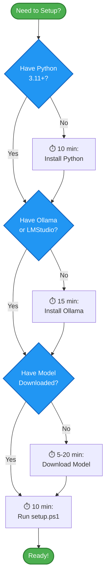
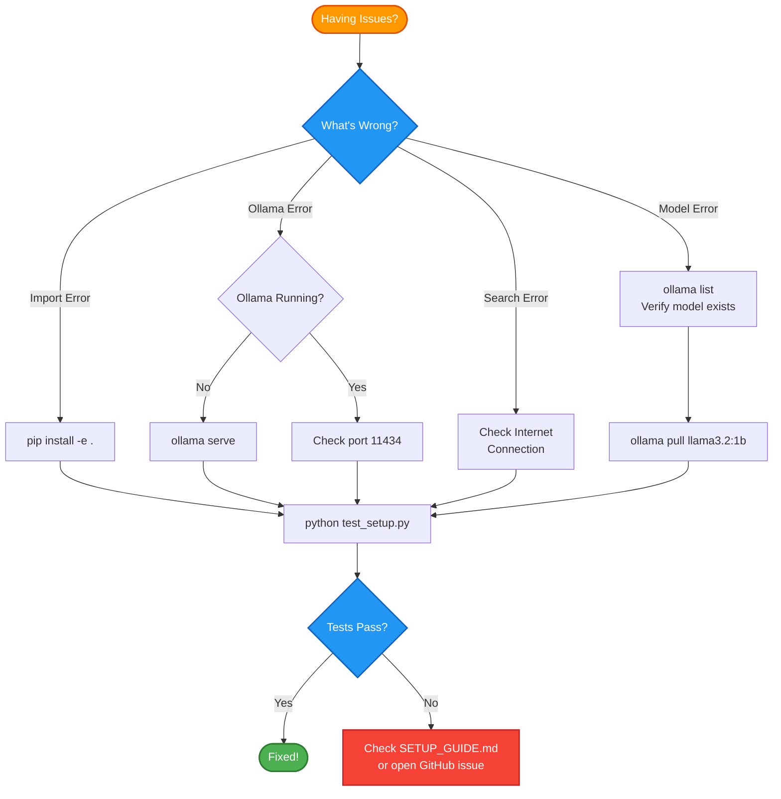
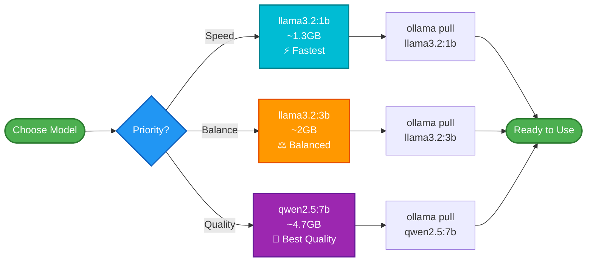
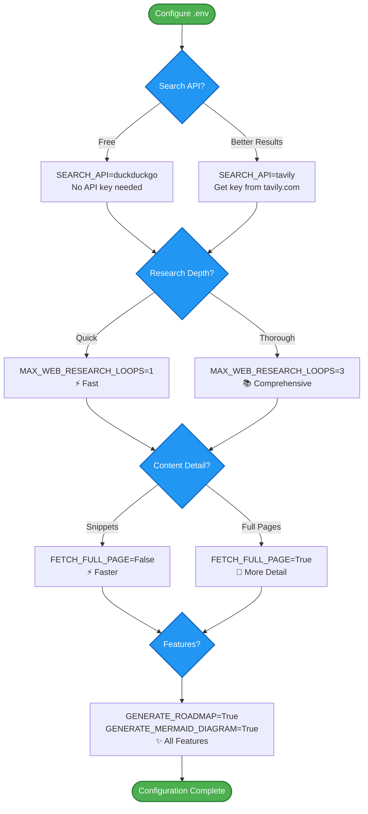

# Setup Process Flowchart

Visual guide to setting up Ollama Deep Researcher

## Setup Flow Diagram

```mermaid
graph TD
    Start([Start Setup]) --> CheckPython{Python 3.11+<br/>Installed?}
    
    CheckPython -->|No| InstallPython[Install Python 3.11+<br/>from python.org]
    CheckPython -->|Yes| CheckLLM{Choose LLM<br/>Provider}
    InstallPython --> CheckLLM
    
    CheckLLM -->|Ollama| InstallOllama[Install Ollama<br/>from ollama.ai]
    CheckLLM -->|LMStudio| InstallLMStudio[Install LMStudio<br/>from lmstudio.ai]
    
    InstallOllama --> PullModel[Pull Model:<br/>ollama pull llama3.2:1b]
    InstallLMStudio --> LoadModel[Load Model<br/>in LMStudio]
    
    PullModel --> CloneRepo[Clone Repository]
    LoadModel --> CloneRepo
    
    CloneRepo --> InstallDeps{Choose Install<br/>Method}
    
    InstallDeps -->|Automated| RunScript[Run setup.ps1]
    InstallDeps -->|Manual| ManualInstall[pip install -e .]
    
    RunScript --> InstallPlaywright[playwright install chromium]
    ManualInstall --> InstallPlaywright
    
    InstallPlaywright --> ConfigEnv[Copy .env.example to .env<br/>Edit configuration]
    
    ConfigEnv --> TestSetup[Run: python test_setup.py]
    
    TestSetup --> AllPass{All Tests<br/>Pass?}
    
    AllPass -->|No| FixIssues[Fix Issues:<br/>- Check Ollama running<br/>- Verify .env config<br/>- Reinstall packages]
    FixIssues --> TestSetup
    
    AllPass -->|Yes| StartServer[Start Dev Server:<br/>uvx langgraph dev]
    
    StartServer --> OpenBrowser[Open Browser:<br/>http://localhost:2024]
    
    OpenBrowser --> TryQuery[Try Research Query]
    
    TryQuery --> Success([Setup Complete!<br/>Ready to Research])
    
    style Start fill:#4CAF50,stroke:#2E7D32,stroke-width:3px,color:#fff
    style Success fill:#4CAF50,stroke:#2E7D32,stroke-width:3px,color:#fff
    style CheckPython fill:#2196F3,stroke:#1565C0,stroke-width:2px,color:#fff
    style CheckLLM fill:#2196F3,stroke:#1565C0,stroke-width:2px,color:#fff
    style InstallDeps fill:#2196F3,stroke:#1565C0,stroke-width:2px,color:#fff
    style AllPass fill:#FF9800,stroke:#E65100,stroke-width:2px,color:#fff
    style TestSetup fill:#9C27B0,stroke:#6A1B9A,stroke-width:2px,color:#fff
    style FixIssues fill:#F44336,stroke:#C62828,stroke-width:2px,color:#fff
```

## Detailed Steps

### Phase 1: Prerequisites (Green)
1. **Check Python** - Verify Python 3.11+ is installed
2. **Choose LLM** - Select Ollama or LMStudio
3. **Install & Configure** - Set up your chosen LLM provider

### Phase 2: Installation (Blue)
4. **Clone Repository** - Get the project code
5. **Install Dependencies** - Choose automated or manual installation
6. **Install Playwright** - Set up web scraping capabilities

### Phase 3: Configuration (Purple)
7. **Setup Environment** - Configure .env file
8. **Test Setup** - Run verification script
9. **Fix Issues** - Resolve any problems (if needed)

### Phase 4: Launch (Green)
10. **Start Server** - Launch LangGraph development server
11. **Open Browser** - Access the web interface
12. **Try Query** - Test with a research topic

## Time Estimates

| Phase | Time Required | Notes |
|-------|---------------|-------|
| Prerequisites | 10-30 min | Depends on download speeds |
| Installation | 5-10 min | Faster with automated script |
| Configuration | 2-5 min | Quick edits to .env |
| Testing | 2-3 min | Automated verification |
| First Query | 1-5 min | Depends on model size |
| **Total** | **20-53 min** | First-time setup |

## Quick Decision Tree

## Troubleshooting Flow

## Model Selection Guide

## Configuration Options Flow

## View These Diagrams

To view these Mermaid diagrams:

1. **GitHub**: View this file on GitHub (renders automatically)
2. **VS Code**: Install "Markdown Preview Mermaid Support" extension
3. **Online**: Copy diagram code to [mermaid.live](https://mermaid.live)
4. **LangGraph Studio**: Diagrams render in the documentation viewer

## Next Steps

After reviewing the flowcharts:

1. Follow **[QUICK_START.md](QUICK_START.md)** for rapid setup
2. Use **[SETUP_GUIDE.md](SETUP_GUIDE.md)** for detailed instructions
3. Run `setup.ps1` for automated installation
4. Run `python test_setup.py` to verify everything works

---

**Visual learner? These flowcharts show you exactly what to do! 📊**
